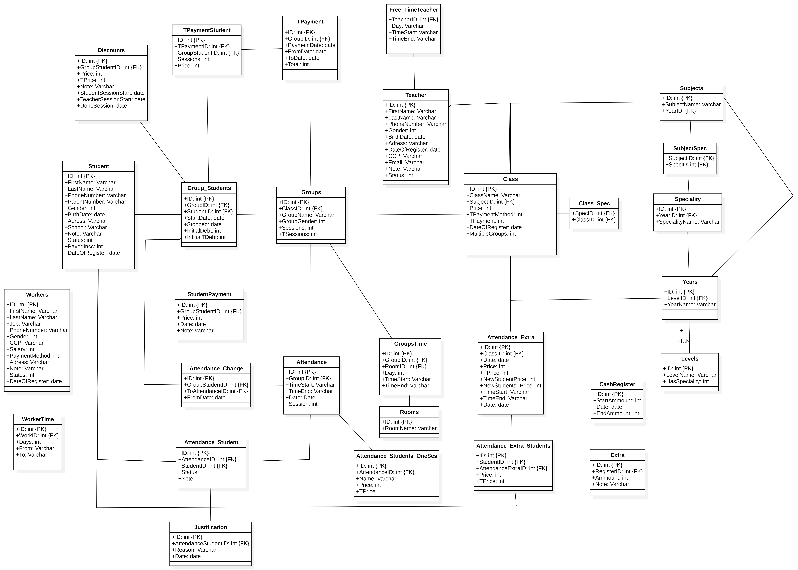

## 1. Real-World Context: The Algerian Tutoring Market 
In Algeria, private tutoring schools are a critical part of the educational ecosystem, hosting hundreds of students daily in intensive from 1 hour to 3-hour blocks. 
Historically, these institutions relied on manual bookkeeping, leading to massive inefficiencies.

This project was designed to automate three critical "Pain Points":

- **Dynamic Scheduling**: Managing limited classroom space against a high volume of subjects and levels.

- **Financial Tracking**: Moving away from paper receipts to a digital ledger that tracks student debt in real-time.

- **Automated Payroll**: Eliminating manual errors in calculating teacher commissions, which often vary by contract and student count.
## 2. Technology Stack & Decision Logic

The choice of technologies was driven by the specific infrastructure and operational habits of tutoring centers in Algeria, prioritizing stability over "trendy" cloud-first approaches.

### **Frontend: WPF (Windows Presentation Foundation)**
Instead of a web application, I developed a native desktop application using **WPF**. 
- **Rich UI/UX:** WPF’s powerful data-binding and XAML styling allowed for a professional, responsive interface that handles high-density data better than older frameworks.
- **Native Performance:** It provides seamless interaction with local hardware (such as thermal printers for student receipts) and the local file system for automatic backups.

### **Backend & Logic: C# / .NET**
I utilized the **.NET ecosystem** for its robustness in enterprise-level desktop software.
- **Business Logic:** C# allowed for the implementation of complex "Teacher Commission" logic and dynamic scheduling rules.
- **Type Safety:** Using a compiled language ensured that financial calculations for student debt and payments remained accurate and bug-free.

### **Database: Local SQL Server (Offline-First Strategy)**
The decision to use a **Local SQL Server** rather than a Cloud-based database was a strategic choice based on the Algerian local environment:

- **Connectivity Constraints:** Many tutoring centers do not have dedicated high-speed internet. Administrative staff often rely on **mobile hotspots (phone tethering)**, which can be unstable and expensive.
- **Operational Continuity:** A cloud-based system would experience significant latency or total downtime during peak hours if the connection dropped. 
- **Data Persistence:** By hosting the database locally, the school remains **100% functional offline**. This ensures that the system is always available to record attendance and payments, even in areas with poor network coverage.
- ### **Key Table Definitions**
## 3. System Design & Data Architecture

A primary goal of this project was to transform a chaotic, manual "pen-and-paper" workflow into a structured relational system. The design focuses on data integrity and real-time operational answers.

### **Entity Relationship Diagram (ERD)**
The database was architected to handle complex dependencies between students, their financial obligations, and classroom availability.

 
*Note: This diagram illustrates the relational mapping used to maintain ACID compliance across all school transactions.*
To manage the high volume of transactions, the database is structured around several core entities:

| Table Name | Purpose |
| :--- | :--- |
| **Level, Year, Speciality, Subject, SubjectSpec** | **The Curriculum Mapping Flow:**    1. **Level & Year:** Define the student's grade (e.g., *High School* -> *3rd Year*).   2. **Speciality:** Applies the specific high school "stream" (e.g., *Experimental Sciences*).   3. **Subject:** The general course being taught (e.g., *Physics*).   4. **SubjectSpec:** This is the **bridge between the Speciality and Subjects**. It handles cases where different specializations share the same subject curriculum, or where a subject's in different speciality differs in their program and intensity (e.g math for language students is different than math for experimental sciences students) |
| **Class, Groups, Group_time** | **The Scaling & Scheduling Logic:**    1. **Class:** Acts as a template for a specific pedagogical unit (e.g., *Mr. Ahmed - Physics - 3rd Year Lycee*).   2. **Groups:** To maintain manageable student-to-teacher ratios, a single `Class` can be split into **1 to N Groups**. This allows the center to scale enrollment while respecting physical room limits.   3. **Group_time (Session Logic):** Since a single group often meets multiple times per week (e.g., a "Physics" group having a lecture on Tuesday from 8PM to 10PM and on Friday 3PM to 5PM), this is kept in a separate table. This allows the system to track **multiple sessions per week** for a single group without duplicating student enrollment data. |
| **`Attendance`** | **The Session Execution Log:** Stores the definitive record of every session actually held, including timestamps and flags for **rescheduled or changed sessions**. |
| **`Attendance_Student`** | **The Core Status Ledger:** Maps registered students to sessions. It tracks specific statuses like **Present**, **Absent**, **Justified**, or **Group Changed**, ensuring financial and academic records remain accurate. |
| **`Attendance_Change`** | **Temporary Session Displacement:** Handles "One-time" group swaps. If a student from Group A attends Group B for one session, this table prevents them from being marked as a "loss" or being double-charged. |
| **`Attendance_OneSes`** | **Guest / Walk-in Enrollment:** A "Fast-Track" logic for students not registered in the school. It records the name and payment for a single session, capturing revenue without the overhead of a full profile. |
| **`Attendance_Extra` & `Extra_Students`** | **Ad-hoc / Exam-Prep Sessions:** Manages "Open Enrollment" sessions held outside the weekly schedule. These allow any student in the school to join a large-scale revision class, regardless of their usual group. |

## 4. Technical Retrospective: Challenges & "Post-Mortem"

Building a comprehensive system for a high-traffic tutoring center revealed challenges that went beyond simple coding. Below is a breakdown of the friction points encountered during development and the business realities that shaped the project.

### **A. Development & Architectural Challenges**
As the project scaled, the lack of a formal architectural pattern (like MVVM) created a "Monolithic" codebase that became difficult to maintain.

* **The "Code-Behind" Trap:** Lacking experience with **MVVM** at the start, I tightly coupled the SQL logic directly into the WPF UI. This "Rapid Prototyping" approach made the system functional but nearly impossible to unit-test or refactor without breaking the interface.
* **From "Spaghetti" to S.O.L.I.D:** This project lacked proper class modularization and clean separation of concerns. Reviewing these structural limitations led me to study **Robert C. Martin’s *Clean Code***. While I did not refactor this specific project, the realization of its architectural flaws was a turning point in my career.
* **UI as a Business Driver:** I learned that for non-technical administrators, **UI/UX is as important as the backend.**  at first i was only focusing on the backend and functionality working which made my ui lacking but then after presenting it to schools i could see that even if things where working and seemed logical to me , for the client had a hard time with the ui which in later versions i improved.

### **B. Business & Operational Challenges**
The "ideal" software solution often clashes with the reality of how a business actually functions on the ground.

* **User "Friction" vs. Data Integrity:** Administrators often had to check in hundreds of students within a 15-minute window. I learned that if a process is too slow, users will bypass it. I designed "Fast-Track" logic (e.g., `Attendance_OneSes`) to balance the need for accurate data with the necessity of speed during peak hours.
* **The Paper-to-Digital Migration:** One of the greatest hurdles was migrating schools with nearly **2,000 active students** whose only records were physical paper ledgers. I had to manage the logistics of data entry while ensuring the school remained operational which lead to many schools not migrate because of the hardship in inserting all the previous data.
* **Standardizing Business Logic:** Every tutoring center had its own "unique" way of managing splits and schedules. To maintain system stability, I had to enforce a standardized workflow. This required me to act as both a developer and a consultant—convincing stakeholders to adapt their manual habits to a structured digital process to gain the benefits of automation.
---
## Conclusion: Reflecting on the Journey

This project was my most significant learning experience as a developer. While I encountered many architectural hurdles and "messed up" in several structural ways, I don't regret a single line of code. Building this system from the ground up allowed me to learn critical lessons first-hand that no textbook could fully convey. 

In fact, these struggles helped me deeply appreciate and understand the theoretical concepts I was taught at university. Seeing a complex system struggle under its own weight made me realize exactly *why* design patterns, clean architecture, and decoupled systems are so vital in the professional world.

I am keeping this repository in its original state as a testament to my growth. It serves as the bridge between the self-taught student I was and the professional Software Developer I am becoming.

---

### Visuals
For a closer look at the user interface and system flow, please visit the [Screenshots](/Screenshots) directory.

### Get in Touch
If you have any questions regarding the source code, the database logic, or instructions on how to launch the application locally, please feel free to reach out.

- **Email:** mouathhakim@gmail.com

*I am always open to discussing software architecture, Algerian tech infrastructure, or new opportunities *
